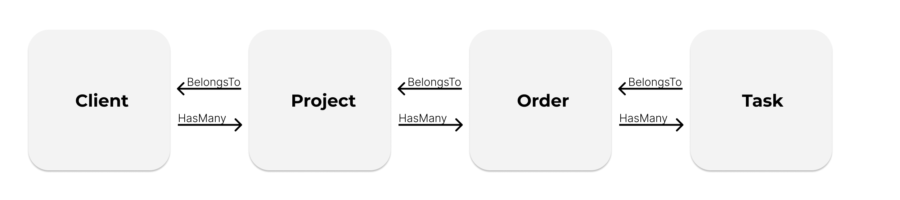

# Laravel Custom Relations

[](https://packagist.org/packages/53199186-ahawlitschek/laravel-power-relations)
[](https://github.com/53199186-ahawlitschek/laravel-power-relations/actions?query=workflow%3Arun-tests+branch%3Amain)
[](https://github.com/53199186-ahawlitschek/laravel-power-relations/actions?query=workflow%3A"Fix+PHP+code+style+issues"+branch%3Amain)
[](https://packagist.org/packages/53199186-ahawlitschek/laravel-power-relations)

Laravel provides some pretty good relations from scratch. If those relations do not fit the need, the community has provided a lot of other relation packages.
Especially [staudenmeir](https://github.com/staudenmeir) did a lot if nice work on that end. However, in our projects we encountered the need of some really custom relations that could easily be expressed with an eloquent query, but not with default relations.
Therefore, we created this package to give you the full control over your relations.

## Introduction
Sometimes it needs to be more custom.
This package extends the default Laravel Relations with Relations that can be described by a query. 

For explanation purposes we consider the following model with a simple concatenated relation use case.
(for cases like this you should also have a look  [eloquent-has-many-deep](https://github.com/staudenmeir/eloquent-has-many-deep) from staudenmeir).
Even the example is quite simple, it should be able to represent the huge amount of possibilities that comes with custom relations.


Let's explorer the connection between Client and Task in the default Laravel way:
```php
$client = $task->order->project->client;
$tasks = $client->projects->flatMap(fn(Project $project) => $project->order->flatMap(fn(Order $order) => $order->tasks));
```

Wouldn't it be cool to do stuff like this with only 1 single database query?
```php
$client = $task->client;
$tasks = $client->tasks;
```

With Custom Relations you can do this with only one single Database Query.


## Installation

You can install the package via composer:

```bash
composer require clickbar/laravel-custom-relations
```

## Preparing the Model
In order to use the Custom Relations, you must use the ``HasCustomRelation`` trait:

```php
use Clickbar\LaravelCustomRelations\Traits\HasCustomRelation;


class Client extends Model{
    
    use HasCustomRelation;
    
    ...
}
```

## Writing the Relation
Like you know from Laravel, relations can return a collection of models or just one model.
Therefore, this package has two Different Relations ``CustomRelation`` and ``CustomRelationSingle``.

Let's look at our two examples from above: 
```php
class Task extends Model {

    use HasCustomRelation;

    public function client(): CustomRelationSingle {
        return $this->customRelationSingle(
            Client::class,
            function ($query) {
                $query
                    ->join('projects', 'clients.id', 'client_id')
                    ->join('orders', 'projects.id', 'project_id')
                    ->join('tasks', 'orders.id', 'order_id');
            },
        );
    }
}
```

```php
class Client extends Model {

    use HasCustomRelation;

    public function tasks(): CustomRelation {
        return $this->customRelation(
            Task::class,
            function ($query) {
                $query
                    ->join('orders', 'orders.id', 'order_id')
                    ->join('projects', 'projects.id', 'project_id')
                    ->join('clients', 'clients.id', 'client_id');
            },
        );
    }
}
```

Like regular Laravel Relations, the query builder starts from the related model.
This results in the following join chains:  
$task->client: ``Client->Projects->Orders->Tasks``  
$client->tasks: ``Tasks->Orders->Projects->Client``

If you prefer starting the join from the model the relation is defined on, you can use the method with the ``fromParent`` suffix:
```php
class Task extends Model {

    use HasCustomRelation;

    public function client(): CustomRelationSingle {
        return $this->customRelationFromParentSingle(
            Client::class,
            function ($query) {
                $query
                    ->join('orders', 'orders.id', 'order_id')
                    ->join('projects', 'projects.id', 'project_id')
                    ->join('clients', 'clients.id', 'client_id');
            },
        );
    }
}
```

```php
class Client extends Model {

    use HasCustomRelation;

    public function tasks(): CustomRelation {
        return $this->customRelationFromParent(
            Task::class,
            function ($query) {
                $query
                    ->join('projects', 'clients.id', 'client_id')
                    ->join('orders', 'projects.id', 'project_id')
                    ->join('tasks', 'orders.id', 'order_id');
            },
        );
    }
}
```

## Limitations
Since the query might introduce a lot of joins, some methods known from Laravel Relations are not available:
- make
- create
- update
- forceCreate
- forceDelete

## Testing

```bash
composer test
```

## Changelog

Please see [CHANGELOG](CHANGELOG.md) for more information on what has changed recently.

## Contributing

Please see [CONTRIBUTING](CONTRIBUTING.md) for details.

## Security Vulnerabilities

Please review [our security policy](../../security/policy) on how to report security vulnerabilities.

## Credits

- [Adrian Hawlitschek](https://github.com/53199186+ahawlitschek)
- [All Contributors](../../contributors)

## License

The MIT License (MIT). Please see [License File](LICENSE.md) for more information.
